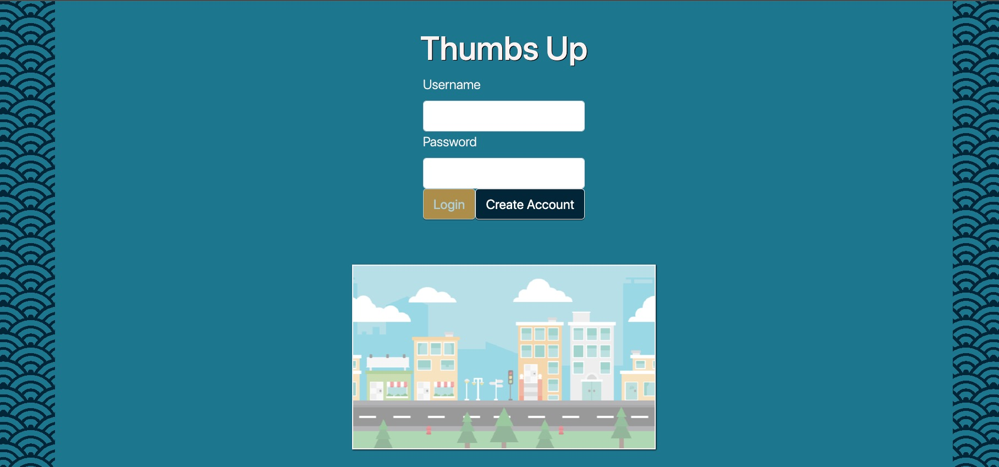

<h1 align="center">Thumbs Up</h1>

## Description
**Thumbs Up** is a carpooling/ride-sharing application that connects riders and drivers who are looking to decrease cost of travel and reduce their carbon footprint. This full stack app allows drivers to post trips they will be taking with specific starting and ending desitinations, while riders are able to search for trips they wish to take and request a seat on a scheduled trip. Once the driver accepts the rider on a trip, they are able to use a real time chat feature to schedule pick-up locations and negotiate fuel costs. Both riders and drivers are able to view their upcoming and previous trips, and riders have the ability to rate their driver on a 5 star scale.

The app was designed and developed from scratch by a team of 6 engineers in 1.5 weeks. Front end technologies used include ReactJS, React Router, React-Bootstrap, Webpack, Babel, HTML5, and CSS3. Back end technologies include ExpressJS and PostgreSQL.

<h3 align="center">
<a href="https://lit-castle-22669.herokuapp.com/">Live Demo</a>
</h3>

---

## Project Responsibilities
Each team member was responsible for developing different features in the app accross the entire stack. My contribution to **Thumbs Up** resides primarily in the development of the upcoming rider trip list and riders/drivers tirp history (shared component). Inside the riders trip history, riders are able to rate drivers using a 5 star rating system and only rate the driver once per trip.

**To see these features in action, visit the Usage section below.**

---

## Installation
**Make sure your system meets the requirements below before following installation**
1. Clone this repo to your local machine:
    - `git clone https://github.com/Mitch311G/Thumbs-Up.git`
2. Navigate the repo's root directory:
    - `cd Thumbs-Up`
3. Install project dependencies:
    - `npm install`
4. For local development, set up a local [PostgreSQL](https://www.postgresql.org/docs/) database.
    - After your local database is available, create a `.env` file in the root directory containing your local database info. See `.env.example` for reference.
        - **NOTE:** The PostgreSQL server will defualt to `port 5432`.
    - Uncomment lines inside section titled **"for development purposes only"** in the `backend/database/schema.sql` file.
    - Run `psql -d blueocean -f ./backend/database/schema.sql` in the root directory of the project to create the project's database and load test data.
5. Run `npm run build-dev` to build `dist/bundle.js`.
6. Run `npm run start-dev` to start development server at `localhost:3000`.
7. Start developing!

### Requirements
1. Install the following on your system (if not done already):
    - [Node.js and npm](https://nodejs.org/en/download/)
    - [PostgreSQL](https://www.postgresql.org/download/)
2. Obtain a [Google Maps API key](https://developers.google.com/maps)

---

## Usage
- **Sample Rider:** Username: FryGuy Password: 456
- **Sample Driver:** Username: MrFripple Password: 123

### Navigate to rider portal

### View upcoming rider trips and chat with driver

### View rider trip history and rate driver

---

## Provided scripts
- `npm run build-dev`
    - Using webpack and babel, this will bundle and transpile the contents of `client/src` directory into bundled `.js` file for browser consumption, which is linked to `index.html`, then **watch for changes and re-bundle on file changes**.
- `npm run build`
    - Builds the bundle for production and **does not watch for file changes**.
- `npm run start-dev`
    - Starts the development server (default is localhost:3000), then **watches for changes and restarts the server with updated content on file change**.
- `npm run start`
    - Starts the app's server, but **does not watch for file changes**.

---

## Author and acknowledgment
***Thumbs Up*** was written by [Mitchell Gardner](https://github.com/Mitch311G), [Prith Jaganathan](https://github.com/prith98), [Matt Dziedzic](https://github.com/MrFripple), [Neil Mosser](https://github.com/NeilMosser), [Ezra Pullido](https://github.com/ezra-pullido), and [Sterling Muller](https://github.com/sterlingmuller).
